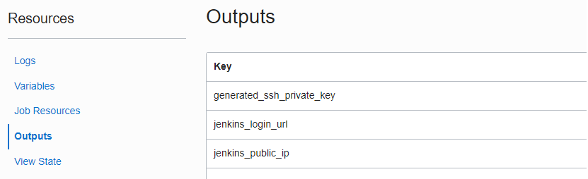

# Setting up the Jenkins VM
[[Return]](../README.md#oracle.devops.jenkins.sample) [[< Step 1]](1.terraform.md) [[Step 3 >]](3.jenkins.md)
## SSH
One the Job completes, navigate to the Stack Job (the job created by ORM after clicking Apply)

1. On the left, under `Resources > Output`



2. __Copy__ the `jenkins_public_ip` value

3. __Copy__ the `generated_ssh_private_key` value and create a file with it (example filename: _private_key_ )

4. __SSH__ into the jenkins_public ip

```bash
ssh -i <private_key> opc@<jenkins_public_ip>
```


## Installing missing and required commands

Once you have SSH'd in, you will need to install 2 things: (1) Docker - to do docker commands, build the image and push (2) Git - to allow us to checkout the repository in our Jenkinsfile

1. __Become__ super user
    ```
    sudo su
    ```


2. __Install__ Git
    ```
    yum install git-all
    ```

3. __Install__ kubectl
(follow: https://kubernetes.io/docs/tasks/tools/install-kubectl-linux/)
    ```
    ```

4. __Install__ OCI CLI
    ```
    ```


5. __Install__ Docker.  (following: https://docs.docker.com/engine/install/centos/)
    
    First, remove previous installations
     
    ```bash
    sudo yum remove docker \
        docker-client \
        docker-client-latest \
        docker-common \
        docker-latest \
        docker-latest-logrotate \
        docker-logrotate \
        docker-engine 
    ```
    ```
    sudo yum install -y yum-utils
    ```
    __For Oracle Linux Oracle-Linux-7.9-2021.12.08-0__:
    Add the Docker CE repository to the YUM config manager for CentOS 
    ```
    sudo yum-config-manager \
        --add-repo \
        https://download.docker.com/linux/centos/docker-ce.repo
    ```
    Install docker-ce

    ```
    sudo yum install docker-ce docker-ce-cli containerd.io
    ```
    If installations issues occur due to dependency issues: refer to [Notes](#notes)

    Start the docker service
    ```
    sudo systemctl start docker
    ```


## Docker Post Installation
To avoid having to use sudo commands for Docker in your Jenkinsfile,
follow the post-installation steps from:
https://docs.docker.com/engine/install/linux-postinstall/

1. Add opc to the docker group
    ```
    sudo usermod -aG docker opc
    ```

2. Add jenkins to the docker group
    ```
    sudo usermod -aG docker jenkins
    ```


3. __Logout__ and log back in, the opc user will no longer require sudo. As the opc user
    ```bash
    docker ps


    # gives
    [opc@exampleVM ~]$ docker ps
    CONTAINER ID   IMAGE     COMMAND   CREATED   STATUS    PORTS     NAMES

    ```
    This completes the setup.


---

## Notes
The following are issues that may appear.

> Issue: I cannot install docker-ce-stable due to dependency resolution issues like the one below

>Error: Package: docker-ce-rootless-extras-20.10.2-3.el7.x86_64 (docker-ce-stable)
           Requires: fuse-overlayfs >= 0.7

```
You may need to add centos extras to your yum repository /etc/yum.repos.d/docker-ce.repo

https://stackoverflow.com/questions/65878769/cannot-install-docker-in-a-rhel-server
```


> Issue: Jenkins is complaining about not being able to access the daemon
```
You may need to follow Docker's post-installation steps abd restart the jenkins service

https://docs.docker.com/engine/install/linux-postinstall/

$ service jenkins restart
$ service jenkins status

```
> I restarted my compute instance and I am getting the following:

> Cannot connect to the Docker daemon at unix:///var/run/docker.sock. Is the docker daemon running?
```
You may need to enable docker to start on boot

$  sudo systemctl enable docker.service
$  sudo systemctl enable containerd.service
```


[[Return]](../README.md#oracle.devops.jenkins.sample) [[< Step 1]](1.terraform.md) [[Step 3 >]](3.jenkins.md)