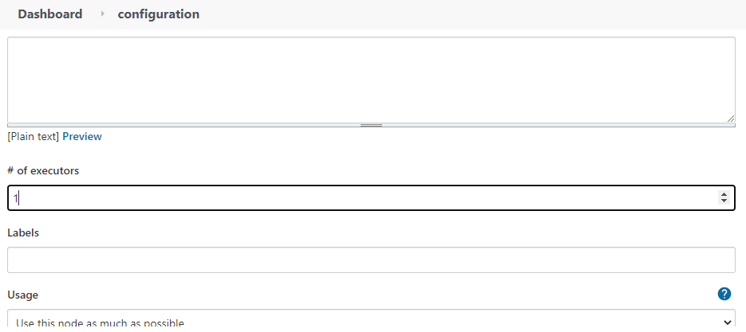

# Setting up Jenkins
[[Return]](../README.md#oracle.devops.jenkins.sample) [[< Step 2]](2.vm.md) [[Step 4 >]](4.pipeline.md)

We now can setup Jenkins and add useful plugins. Other plugins such as git and oci-compute are already installed during the Terraform stage by the terraform files we used to provision our resources

## Navigate to the Jenkins Portal
You can get to your Jenkins portal through port 8080 (this port was customized by the Terraform script provisioning the VM and installing Jenkins)
```
http://<jenkins_public_ip>:8080
```

## 

1. Login with your credentials you supplied in [Provisioning Lab Resources > Terraform and ORM Step 4.c](1.terraform.md#terraform-and-orm) and login as `admin` as your username

2. Update executors by going to `Dashboard > Manage Jenkins > Configure System > # of executors` and set it to at least 1. Save and Apply.



3. Add Docker plugin by going to `Dashboard > Manage Jenkins > Manage Plugins > Available (tab)` and search for `Docker Pipeline`

    This will allow us to do workflows with Docker without having to type docker commands.

    Mark the item (checkbox for install) and at the bottom, `Install without restart`


[[Return]](../README.md#oracle.devops.jenkins.sample) [[< Step 2]](2.vm.md) [[Step 4 >]](4.pipeline.md)
