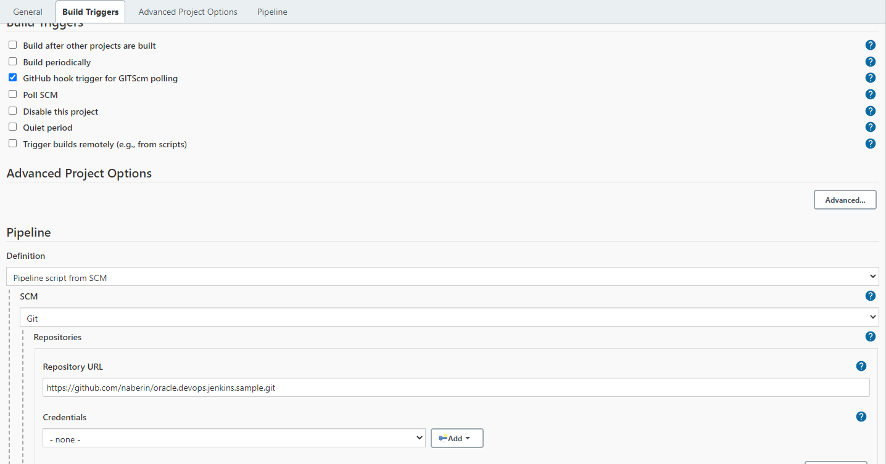
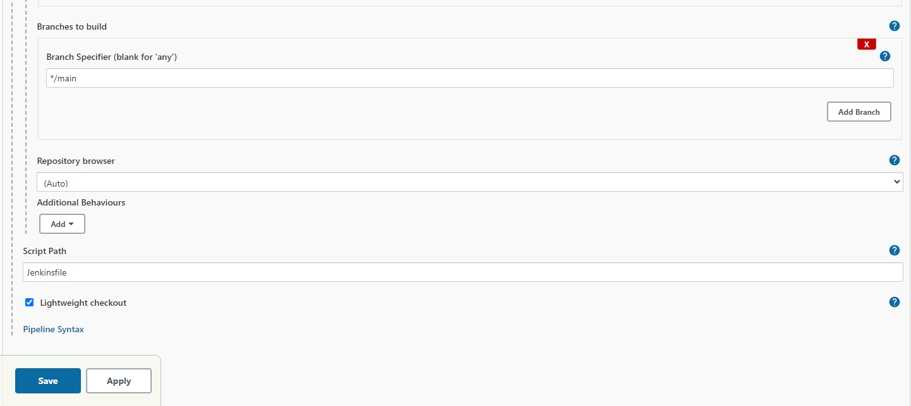
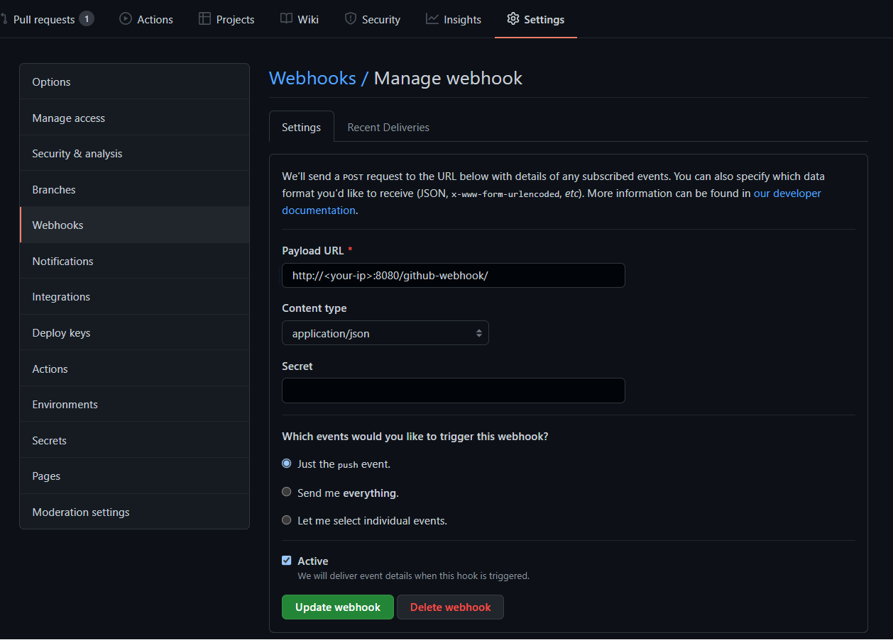

# Setup Jenkins Pipeline and GitHub webhook

[[Return]](../README.md#oracle.devops.jenkins.sample) [[< Step 3]](3.jenkins.md)

Now we can create a pipeline and have our repository trigger docker builds and push the built image to our OCIR

## Fork or Clone the Sample Repository
You will need to have a repository of your own to manage the WebHook settings in the following steps below

https://github.com/naberin/oracle.devops.jenkins.sample

<br/>

## Create Pipeline

1. First create a New Pipeline via `Dashboard > New Item > Pipeline`

    a. Enter an Item Name
    
    b. Select Pipeline

    c. press OK

2. Under Build Triggers, select `GitHub hook trigger for GITScm polling`

    This will make the GitHub plugin check if the github repository matches the defined Git repository and if there has been a change, will trigger a build.

3. Under Pipeline, you can either use `Pipeline script from SCM` or directly write your script through the `Pipeline script` option. Since our Jenkinsfile (Jenkins script is included) in the same repository as the application we want to build, select `Pipeline script from SCM`.
 

    a. Change SCM from None to `Git`

    
    b. Under Repository URL, add the URL for this repository.
    ```
    EXAMPLE: https://github.com/naberin/oracle.devops.jenkins.sample
    ```

    c. Since this repository is __Public__ and not Private, we will __NOT__ need a credential.
    Otherwise, for Private repositories, please create a Jenkins credential with Jenkins.

    https://www.jenkins.io/doc/book/using/using-credentials/

    

    d. Since my main branch is called `main` and __NOT__ `master` Change the Branches to build from `*/master` to `*/main`


    e. Press Apply and Save.

    The remaining settings look like the following:

    
<br/>

## Create Jenkins Credentials

Since our pipeline will need to login into our OCI Registry to push the built image, create a Jenkins credentials.


(Following: https://www.jenkins.io/doc/book/using/using-credentials/) In your Jenkins dashboard, Navigate to `Dashboard >  Manage Jenkins > Manage Credentials`


1. You can create a new domain. Or just use Jenkins' Global credentials store. Select it and `Add Credentials`

2. Select 

    a. For the Kind, `Username with password`

    

    b. Add your OCIR username
    (https://docs.oracle.com/en-us/iaas/Content/Functions/Tasks/functionslogintoocir.htm)
    

    c. Add an Auth Token
    https://docs.oracle.com/en-us/iaas/Content/Functions/Tasks/functionsgenerateauthtokens.htm

    d. Set your custom ID value and __COPY__ this value


<br/>

## Setup GitHub WebHook

In your own repository, navigate to `Settings > Webhooks > Add webhook`

1. For the Payload URL, add your `http://<jenkins-ip-address>:8080/github-webhook/` as the Payload URL.

    > Note that we added /github-webhook/ to the end of the endpoint. The trailing slash is REQUIRED.

2. Change the Content Type to `application/json`

    

3. Create/Publish the Webhook

<br/>

## Modify the Jenkinsfile

Inside the `Jenkinsfile` in the repository, update the variables inside the environment block.

```
    environment {
        docker_region = "iad"
        docker_img = "${docker_region}.ocir.io/<YOUR-TENANCY-NAMESPACE>/<REPOSITORY>:<TAG>"
        docker_registry = "https://${docker_region}.ocir.io"
        docker_credential_id = "ocir-orasenatdoracledigital01"
        
        repository_url = 'https://github.com/naberin/oracle.devops.jenkins.sample'
        repository_branch = 'main'
    }
```
Update the following: 
1. `docker_region` is the 3 letter abbreviation for your OCI region

2. `docker_img` should match your OCIR repository

    a. change `<YOUR-TENANCY-NAMESPACE>` to your tenancy namespace

    b. change `<REPOSITORY>` to your OCIR repository

    c. change `<TAG>` to your desired image tag, you can also add Jenkins substitution variables here

3. `docker_credential_id` is the credentials ID you created in [Step 2.d](#create-jenkins-credentials)

4. `repository_url` should point to your own repository


Helpful Links:

https://docs.oracle.com/en-us/iaas/Content/Functions/Tasks/functionslogintoocir.htm


## Initial Build

__Important__

Manually build the job once and your job should start building the React frontend and pushing it to your OCI Registry.


<br/>

## GitHub Push

In your code repository, in the __main__ branch

1. Under `frontend > src > App.js`, update `line 11` inside the paragraph <p> tag with `id="UPDATE-HERE"`.

2. Commit your changes and __push__ to main


[[Return]](../README.md#oracle.devops.jenkins.sample) [[< Step 3]](3.jenkins.md)